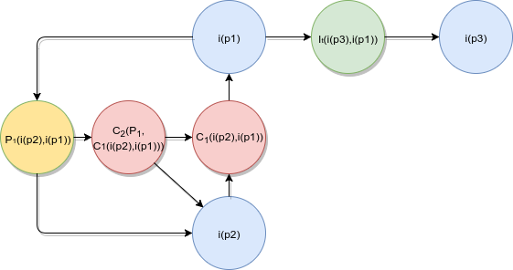
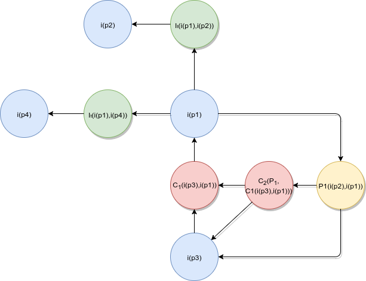

## Sobre

Este artefato apresenta as argumentações elaboradas para funcionalidades sugeridas pela equipe a serem incluídas na plataforma estudada.

## Feature 1 - Sistema de branch para Wiki

  

### Informações
* Data: 20/08/17  
* Autoria: Equipe  
* Versão: 1.0  

#### Argumentações
* i(p1): Criar um sistema de branches similar ao já utilizado no git, para versionar e analisar documentos e artefatos dentro de uma wiki de um projeto
* i(p2): A wiki é um repositório, pode-se criar branches offline mas apenas a master é publicada. Para criar branches remotas para a Wiki de um projeto, deve-se criar um novo projeto dedicado a manutenção da wiki, utilizando o mesmo repositório clonado.Pode-se adicionar uma url-remota para o projeto e outra para a Wiki. As branches públicas ficam no projeto da wiki, mas a Wiki tem apenas a master.
* i(p3): Eu apoio a criação dessa funcionalidade, pois iria facilitar na visualização dos trabalhos que estão sendo realizados e ficaria muito fácil em colocar um trabalho novo
para o documento principal devido ao sistema de PR que existe na plataforma do GitHub para parte de código (que iria checar os conflitos antes de merjar). 
* P1: Apresentadas as argumentações favoráveis, apoiamos a implementação da feature como forma de facilitar a gerenciamento de branches dos projetos na wiki. Apesar
de ainda acreditar que a implementação dessa feature pode não agregar valor de fato, pois já é possível publicar branches remotamente utilizando o processo já descrito. 

## Feature 2 - Sistema de commits com notificação

  

### Informações
* Data: 20/08/17  
* Autoria: Equipe  
* Versão: 1.0  

#### Argumentações
* i(p1):  Inserção do sistema de commits com notificação.
* i(p2):  O sistema iria trazer um beneficio para os desenvolvedores, pois iria trazer um alerta maior para os commits críticos para o projeto.
* i(p3): A implementação de uma funcionalidade com fins de notificação já existe dentro do GitHub, pois quando 
associado a uma issue, já é disparada uma notificação.  
* i(p4): A proposta se mostra muito interessante e útil, visto que, apesar de já existir funcionalidade semelhante para o uso de issues, milestones e pull requests, ainda não há uma forma de notificação para commits importantes fora de tais usos, ou seja, ao se trabalhar com branches simples.
* P1: Conforme acordado, que não existiria uma notificação por push ou por email e sim um alerta visual, é interessante a implementação da funcionalidade, porém o sistema deve ser conhecido como um sistema de alerta e importância e não como de 'notificações'.