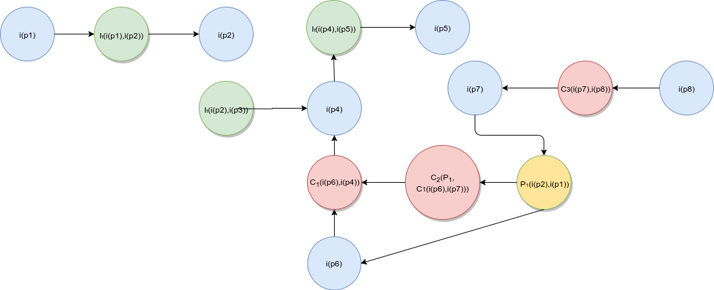
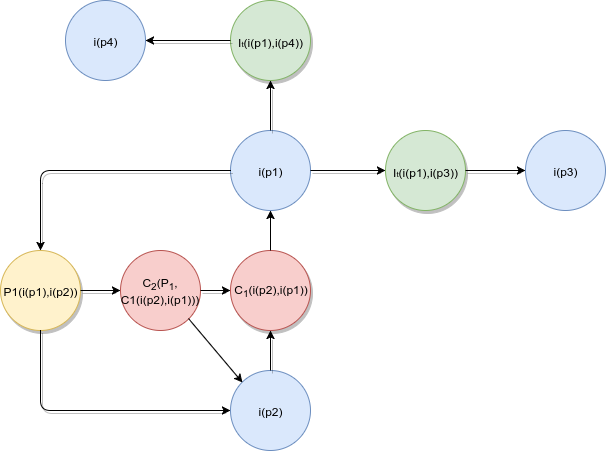

## Sobre

As argumentações foram criadas de acordo com as principais funcionalidades apresentadas pelo GitHub, na página “Features”, disponível em https://github.com/features.

Cada membro ficou responsável por uma funcionalidade. Através de tempos definidos, a equipe discutiu cada funcionalidade, e cada membro apresentou seus pontos de vista acerca da dela.

O responsável pela funcionalidade pode então elaborar o diagrama de argumentação de acordo com as inferências, conflitos e predições levantadas, seguindo os padrões do framework ACE (_Acceptability Evaluation Framework_).

Ao final do processo, obteve-se o diagrama de argumentação de cada funcionalidade. 

## Argumentações	
### 1. Integração através do GitHub Marketplace (Integrations)
#### 1.1. Diagrama

#### 1.2. Informações
* Data: 04/09/2017
* Autor: Kairon Velozo
* Versão: 1.0

#### 1.3. Argumentações

* i(p1): Integração de softwares de terceiros nos repositórios contidos na plataforma.  
* i(p2): Os softwares podem gerar insights aos desenvolvedores em pontos como qualidade de código e cobertura e testes.  
* i(p3): Facilita processos de integração e entrega contínua com o uso de softwares que automatizam esses processos e são integrados diretamente aos repositórios.  
* i(p4): Praticidade em encontrar ferramentas em apenas um lugar.  
* i(p5): Ferramentas que promovem um auxílio nas etapas do processo de desenvolvimento, os tornando mais práticos e facilitando sua manutenção.  
* i(p6): Criação de apps de integração desnecessários, que agregam pouco valor e poluem a GitHub Marketplace. 
* i(p7): A existência de uma equipe que avalia e não permite que aplicativos ruins ou desnecessários entrem na GitHub Marketplace. 
* i(p8) Incluir aplcação de terceiros implicará na falta de futuras ferramentas próprias do GitHub.  

### 2. Revisão de Código
#### 2.1. Diagrama
 *Inserir*
#### 2.2. Informações
* Data: 04/09/2017
* Autor: *inserir*
* Versão: 1.0

#### 2.3. Argumentações
* i(p1):  Trazer ferramentas complexas do git para web através de algo visual.  
* i(p2):  Criar uma ferramenta para merge de branchs do mesmo projeto, de forma visual onde haverá checagem
de conflito de código e um outro desenvolvedor deve aceitar os dados que estão chegando.  
* i(p3): Pull requests podem tornar burocrática a contribuição de desenvolvedores num projeto, caso não haja
alguém para revisar o código a ser integrado ao projeto.  
* i(p4): Pull requests são burocráticos e podem causar um gargalo em equipes que criam várias builds em um curto espaço de tempo. Pode ocorrer a criação de um papel de testador, porém o mesmo deixaria de render como
um desenvolvedor comum.  
i(p4): Essa demora para ser aprovado não é algo negativo pois o dono do repositório que vai definir a frequência de revisão de código, se um repositório estiver com velocidade alta de aprovações as pessoas irão contribuir com ele, caso os desenvolvedores verem que não há uma velocidade em aprovar os PRs logo os desenvolvedores não irão consequentemente trabalhar nesses projetos. Logo é opção do dono da branch em aprovar ou não. Os desenvolvedores poderão ver as diferenças aplicadas em um trecho de código, identificando o autor da mudança e a data. Os desenvolvedores poderão comentar numa mudança realizada, afim de prover feedback ao autor da mudança. Resolução de conflitos.

### 3. Documentação
#### 3.1. Diagrama

 *Inserir*  

#### 3.2. Informações
* Data: 04/09/2017
* Autor: *inserir*
* Versão: 1.0

#### 3.2. Argumentações
* i(p1):  Ferramenta para hospedagem de documentação dos projetos.  
* i(p2):  Hospedar a documentação na Wiki.  
* i(p3):  Hospedar a documentação em uma pagina.  
* i(p4):  Criar o "readme.md" do projeto que servirá para expor a introdução e informações básicas acerca do projeto, licença, contribuição etc.  
* i(p5): Permitir que o desenvolvedor se comunique com o usuário de forma fácil e clara. 
* i(p6): Velocidade na edição.  

### 4. Hospedagem de Código no GitHub (Code Hosting)
#### 4.1. Diagrama
*Inserir*

#### 4.2. Informações
* Data: 04/09/2017
* Autor: *Inserir*
* Versão: 1.0

#### 4.3. Argumentações
* i(p1): Criar versões do software referentes ao estado presente do repositório.  
* i(p2):  Definir o nome da versão ou release do software.  
* i(p3): Possuir um histórico de versões estáveis, em teste e legado de um software.  
* i(p4): Distribuição do projeto empacotado (zip). Integração com cloud para distribuição de assets em binário.
* i(p5): Utilização de projetos em SVN e projetos no Git LFS, respectivamente para projetos em não-Git e projetos muito grandes e volumosos.  
* i(p6): Utilização de plataformas de nuvem de terceiros para controle do fluxo de dados.  
* i(p7): Necessidade dos usuários (desenvolvedores) de hospedar seus projetos e os distribuir.  
* i(p8): Criação de ferramentas para disponibilização, versionamento, histórico e hospedagem de código e lançamentos.  

### 5. Gerenciamento de Projetos (Project Management)
#### 5.1. Diagrama

#### 5.2. Informações
* Data: 04/09/2017
* Autor: Weyler Almeida Gomes
* Versão: 1.0

#### 5.3. Argumentações
* i(p1): Criação de ferramentas para gerenciamento de projetos de tecnologia  
* i(p2): Perde-se hierarquia dos diferentes papeis do ciclo de desenvolvimento de software. Deixando o
gerenciamento mais horizontal, contribuindo para o aumento de riscos e não cumprimento de prazos.    
* i(p3): Promove a integração contínua e a transparência sobre o andamento do projeto.  
* i(p4): Proporciona uma gerencia remota.
* P1: A horizontalidade criada é positiva.  

### 6. Gerenciamento de Comunidade (Community Management)
#### 6.1. Diagrama
*Inserir*

#### 6.2. Informações
* Data: *Inserir*  
* Autor: *Inserir*
* Versão: 1.0

#### 6.3. Argumentações
*Inserir*