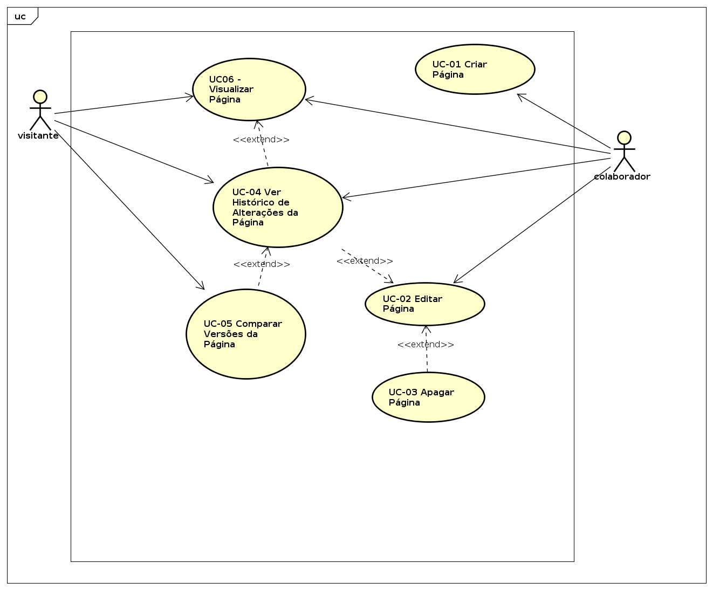

Autor: Kairon Velozo

***

## 1. Introdução

Este artefato apresenta as especificações dos casos de uso para a área de documentação nos repositórios no GitHub (wiki).

A wiki é uma das funcionalidades apresentadas pelo GitHub para o gerenciamento de documentação de projetos. Possui uma série de opções que permitem que os usuários do GitHub possam elaborar e gerenciar a documentação de seus projetos de maneira simples e prática, com ferramentas disponíveis diretamente na plataforma.

Ações desempenhadas por um ator em específico o nome do ator é explicitado. Ações as quais podem ser realizadas por mais de um ator, adota-se a referência "ator" para fins de generalização.

## 2. Identificação dos atores
| Ator   |      Nome do Ator      |  Descrição Ator |
|--------|:----------------------:|:----------------:|
| Ator 01 |  Colaborador | Uma pessoa que está envolvida que esta na sua organização e que possa ler, escrever ou permissões de administrador para um ou mais repositórios na sua organização.  |
| Ator 02 |  Visitante | Qualquer pessoa com acesso à funcionalidade.  |

## 3. Diagrama de Casos de Uso

 <a target='_blank' href='images/uc/documentation.png'> Diagrama de Caso de Uso </a> 

## 4. Espeficicação dos Casos de Uso

### UC-01 Criar Página na Wiki

**Descrição**:  
Permitir a criação de páginas na wiki.

**Atores**  
Colaborador

**Pré-Condições**  
1. Colaborador deve estar logado em sua conta
2. A wiki do repositório deve estar habilitada.

**Fluxo Principal**  
1. O colaborador entra no repositório do projeto e clica em "Wiki"
2. O colaborador clica em "New Page"
3. O colaborador preenche as informações da página:
  * Título;
  * Conteúdo da Página.
4. O colaborador preenche, opcionalmente, o campo "Edit Message" para descrever o commit.
5. O colaborador clica em "Save Page". **(FE.1)**
6. O colaborador é redirecionado para a página criada.

**Fluxo Exceção**  
1. No **passo 4** do **Fluxo Principal** o sistema não permitirá salvar página caso o título da página já esteja em uso por outra página. O caso de uso retorna ao **passo 3** do **Fluxo Principal**.

### UC-02 Editar Página da Wiki  

**Descrição**  
Permitir a edição de informações de uma página da wiki. 

**Atores**  
Colaborador

**Pré-Condições**  
1. Colaborador deve estar logado em sua conta.
2. A wiki do repositório deve estar habilitada.
3. A editada a ser apagada deve existir.

**Fluxo Principal**  
1. O colaborador entra no repositório do projeto e clica em "Wiki".
2. O colaborador entra na página que deseja editar e clica em "Edit Page".  **(FA.1)**
3. O colaborador realiza as alterações desejadas na página:
  - Título;
  - Conteúdo da Página.
4. O colaborador preenche, opcionalmente, o campo "Edit Message" para descrever as alterações realizadas (_commit_).
5. O colaborador clica em "Save Page". **(FE.01)**
6. O colaborador é redirecionado paga a página editada.

**Fluxo Alternativo**  
1. A partir **passo 2** do **Fluxo Principal**, o colaborador acessa diretamente a página de edição da página desejada, através de sua url única. O caso de uso retorna ao **passo 3** do **Fluxo Principal**.

**Fluxo Exceção**
1. No **passo 5** do **Fluxo Principal** o sistema não permitirá salvar página caso o título da página já esteja em uso por outra página. O caso de uso retorna ao **passo 3** do **Fluxo Principal**.

### UC-03 Apagar Página da Wiki  

**Descrição**  
Permitir a exclusão de páginas da Wiki.

**Atores**  
Colaborador

**Pré-Condições**  
1. Colaborador deve estar logado em sua conta.
2. A wiki do repositório deve estar habilitada.
3. A página a ser apagada deve existir.

**Fluxo Principal**:
1. O colaborador entra no repositório do projeto e clica em "Wiki".
2. O colaborador entra na página que deseja apagar e clica em "Edit Page". **(FA.1)**
3. O colaborador clica em "Delete Page".
4. O sistema apresenta uma mensagem solicitando a confirmação e o colaborador clica em "Ok".
5. A página é apagada e o colaborador é redirecionado para página principal da wiki. **(FE.1)**

**Fluxo Alternativo:**
1. A partir **passo 2** do **Fluxo Principal**, o colaborador acessa diretamente a página de edição da página desejada. O caso de uso retorna ao **passo 3** do **Fluxo Principal**.

**Fluxo Exceção:**
1. No **passo 5** do **Fluxo Principal** o sistema não poderá apagar uma página se ela já foi apagada anteriormente, porém ainda apresentava a opção de apagá-la. O colaborador será redirecionado para a página de erro 404.

### UC04 - Ver Histórico de Alterações da Página  

**Atores**:  
- Colaborador  
- Visitante  

**Pré-Condições**:
1. A wiki do repositório deve estar habilitada.
2. A página a qual se deseja ver o histórico de alterações deve existir.

**Fluxo Principal**:
1. O ator entra no repositório do projeto e clica em "Wiki".
2. O ator entra na página que deseja apagar e clica em "Edit Page". **(FA.1)**
3. O ator clica em "Page History".
4. O ator visualiza em formato de tabela as alterações realizadas com as seguintes informações:
  - autor da alteração;
  - mensagem de alteração;
  - data da alteração;
  - código identificador do _commit_ da alteração.

**Fluxo Alternativo:**
1. A partir **passo 2** do **Fluxo Principal**, o colaborador acessa diretamente a página de edição da página desejada, através de sua url única. O caso de uso retorna ao **passo 3** do **Fluxo Principal**.

### UC-05 Comparar da Versões da Página  

**Descrição**   
Permitir a visualização das alterações presentes em duas ou mais versões de uma página da wiki.

**Atores**  
- Colaborador  
- Visitante  

**Pré-Condições**  
1. A wiki do repositório deve estar habilitada.
2. A página a qual se deseja realizar a comparação de versões deve existir.

**Fluxo Principal**  
1. O ator entra no repositório do projeto e clica em "Wiki".
2. O ator entra na página que deseja apagar e clica em "Edit Page". **(FA.1)**
3. O ator clica em "Page History".
4. O ator visualiza em formato de tabela as versões disponíveis da página. **(FA.2)**
5. O ator escolhe, através de _checkbox_, as versões as quais deseja comparar e clica em "Compare Revisions".
6. O ator visualiza as diferenças entre as versões.

**Fluxo Alternativo**
1. A partir do **passo 2** do **Fluxo Principal**, o ator acessa diretamente a página de edição da página desejada, através de sua url única. O caso de uso retorna ao **passo 3** do **Fluxo Principal**.
2. A partir do **passo 4** do **Fluxo Principal**, o ator acessa diretamente a página de versões da página, através de sua url única. O caso de uso retorna ao **passo 5** do **Fluxo Principal**.

### UC-06 Visualizar Página  

**Descrição**   
Permitir a visualização de uma página da wiki.

**Atores**  
- Colaborador  
- Visitante  

**Pré-Condições**  
1. A wiki do repositório deve estar habilitada.
2. A página a qual se deseja visualizar deve existir.

**Fluxo Principal**  
1. O ator entra no repositório do projeto e clica em "Wiki". **(FA.1)**
2. O ator entra na página que deseja e a página é apresentada.

**Fluxo Alternativo**
1. A partir do **passo 2** do **Fluxo Principal**, o ator acessa diretamente a página desejada, através de sua url única. O caso de uso retorna ao **passo 2** do **Fluxo Principal**.