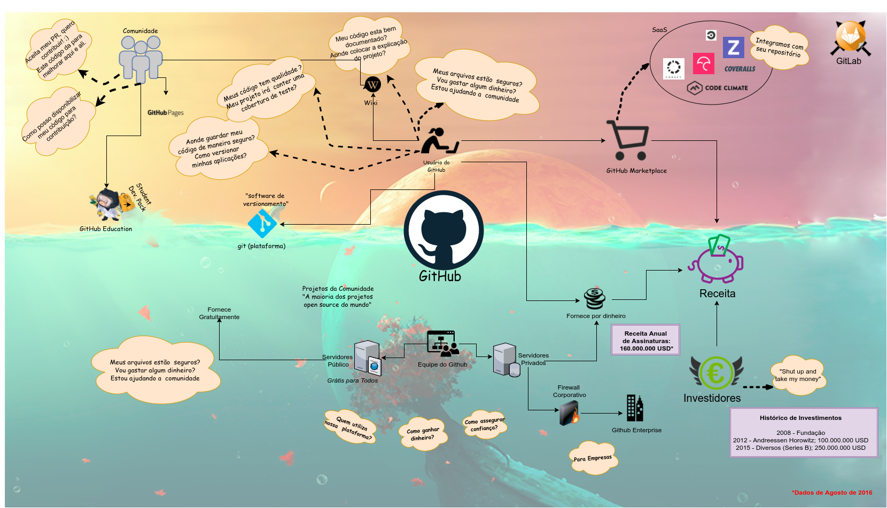
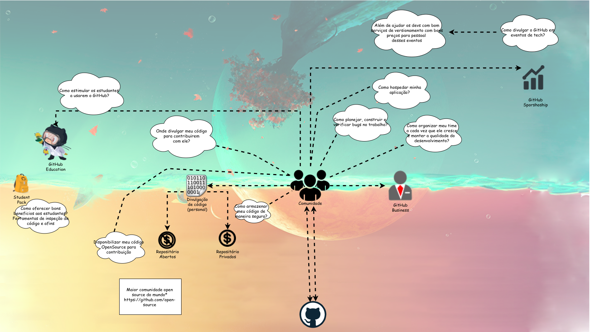
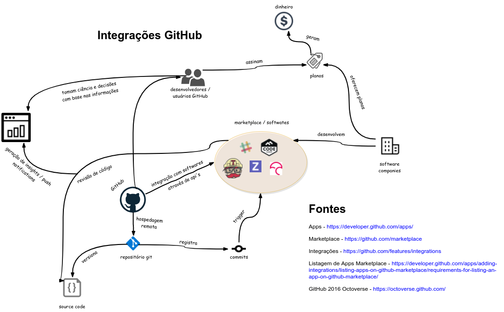

### 1. Geral
#### 1.1. Imagem

#### 1.2. Informações
* Data: 22/08/2017
* Autor: Equipe
* Versão: 1.0

### 2. Gerenciamento de Comunidade (Community Management)
#### 2.1. Imagem

#### 2.2. Informações
* Data: 04/09/2017
* Autor: Varley Silva
* Versão: 1.0

### 3. Integrações (Integrations)
#### 3.1. Imagem

#### 3.2. Informações
* Data: 04/09/2017
* Autor: Kairon Velozo
* Versão: 1.1
